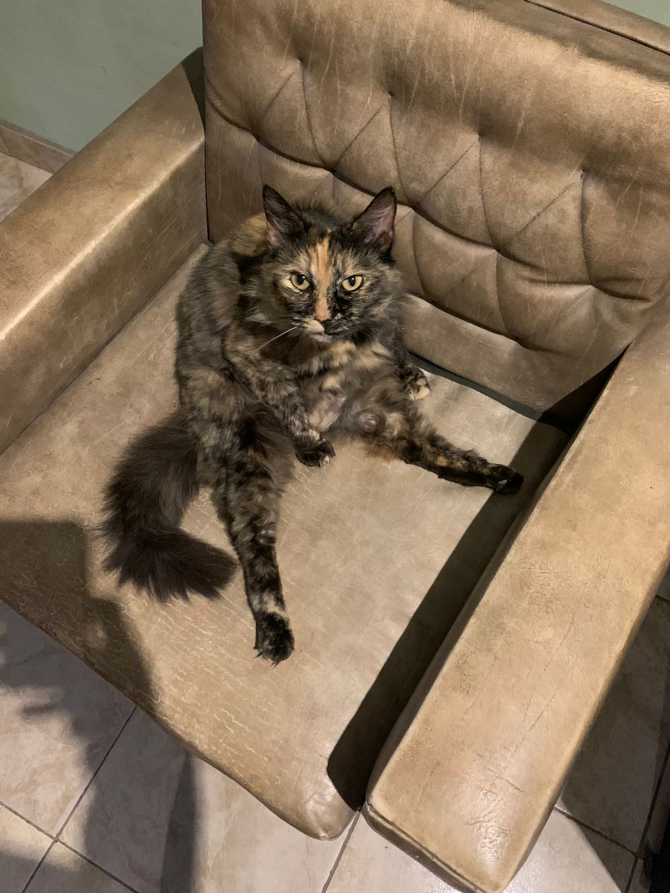

# Programación con objetos I
## Presentación Personal

### Datos Personales
- Mi nombre es Elias Sebastian Dolenz. Vivo en la ciudad de Hurlingham, tengo 29 años. Soy maestro mayor de obras recibido en la escuela ténica n° 2 "República del Perú". 

### Otra Información
- Estudio técnicatura en programación, recién comienzo el segundo año cursando las materias Bases de Datos y Programación orientada a objetos 1. Con muchas expectativas de aprendizaje y crecimiento en particular con la materia Programación.
- Actualmente trabajo como técnico marmolista en la empresa Ragolia Srl. realizando la tarea de medición y confección de planos para la producción e instalación de marmoles.
- Mi cable a tierra es hacer deporte, sea hacer futbol con amigos, o gimnasio, y ver películas / anime para descolgar del estres del día a día.
- Tengo 2 gatos: Delmechon  y Micha .
- Estoy comenzando un emprendimiento para fabricar muebles con diseños y medidas estandar, para poder vender a través de internet.
- Me gusta la naturaleza: playa, montaña, ríos. 
